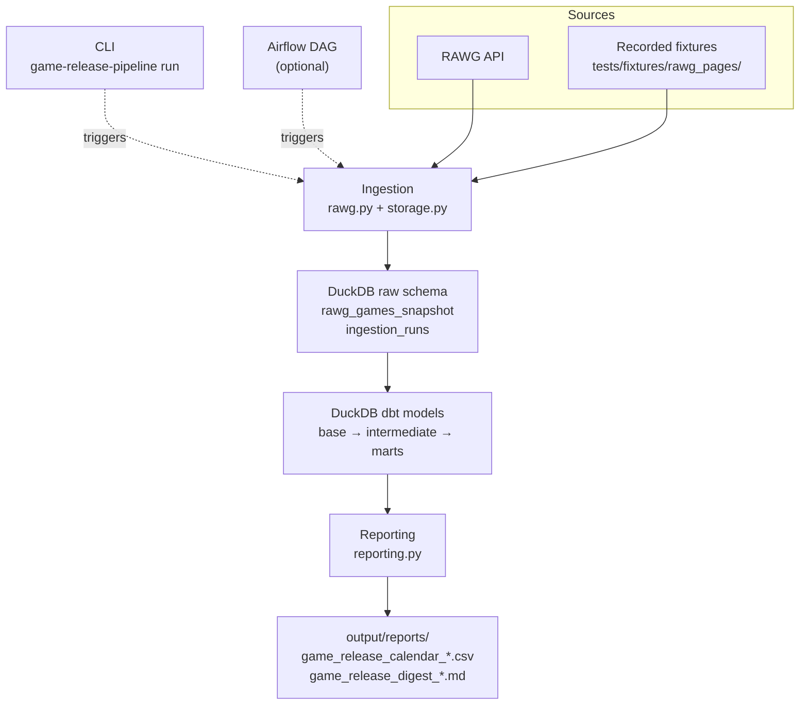

# RAWG Game Release Pipeline

Example end-to-end data engineering project that ingests game release data from the RAWG API, stores a point-in-time snapshot in DuckDB, models it with dbt, and publishes a readable release briefing as Markdown and CSV.

The repo is optimised for a fast local demo. Airflow is included as an optional orchestration showcase, not the default way to run the project.

## What This Demonstrates

- API ingestion with retry handling and snapshot metadata
- Raw-to-mart transformation patterns in dbt
- Local-first analytics infrastructure using DuckDB
- Reusable Python orchestration shared by CLI and Airflow
- Visible stakeholder output instead of only internal tables
- Fixture-backed tests so CI and onboarding do not depend on API credentials

## Architecture



The CLI and Airflow DAG are alternative entry points that run the same Python package ([src/game_release_pipeline/](src/game_release_pipeline/)) to drive ingestion, dbt, and reporting in sequence. The warehouse is a single DuckDB file at `game_release.duckdb` by default, holding both the raw schema and the dbt-built views and tables.

Key runtime areas:

- [src/game_release_pipeline/](src/game_release_pipeline/): package code for ingestion, orchestration, dbt execution, and reporting
- [analytics/dbt/](analytics/dbt/): base, intermediate, and mart models
- [tests/fixtures/rawg_pages/](tests/fixtures/rawg_pages/): deterministic API fixtures used for smoke tests and no-key demo runs
- [orchestration/airflow/](orchestration/airflow/): optional Airflow DAG and Airflow-only runtime helpers

## Quickstart

Run the project locally without a RAWG API key:

```bash
uv sync
uv run game-release-pipeline run --fixtures-dir tests/fixtures/rawg_pages --as-of-date 2026-04-08
```

This produces:

- `output/reports/game_release_calendar_2026-04-08.csv`
- `output/reports/game_release_digest_2026-04-08.md`

The generated digest is a near-term release briefing. It explains:

- what snapshot date the report uses
- which recent and upcoming windows the dataset covers
- which titles are most relevant in the next 90 days
- how platform and genre mix look in the near-term release window

## Live RAWG Run

To run against the live API instead of fixtures:

```bash
cp .env.example .env
# add your RAWG_API_KEY
uv run --env-file .env game-release-pipeline run
```

## Inspecting DuckDB

To open the local DuckDB UI against the configured warehouse file:

```bash
uv run game-release-pipeline duckdb-ui
```

The command uses the same `DUCKDB_PATH` resolution as the rest of the project, so by default it opens [`game_release.duckdb`](game_release.duckdb). If the UI fails because the database is locked, close other write-mode processes first such as an active dbt run, Airflow task, or another DuckDB UI session.

For quick terminal inspection instead of the browser UI:

```bash
uv run duckdb -readonly game_release.duckdb
```

## Testing

```bash
uv run python -m unittest discover -s tests -v
```

The suite covers the CLI, settings loading, RAWG fixture ingestion, report generation, and an end-to-end pipeline smoke test. It uses local fixtures and temporary DuckDB files, so no live RAWG API key is required. See the [setup guide](docs/setup.md#testing) for a breakdown of the command.

## Further Reading

- [Setup guide](docs/setup.md)
- [Portfolio notes](docs/portfolio-notes.md)

## Attribution

Data is sourced from the [RAWG Video Games Database](https://rawg.io/apidocs). If you publish generated outputs, keep RAWG attribution and the source link in place.
